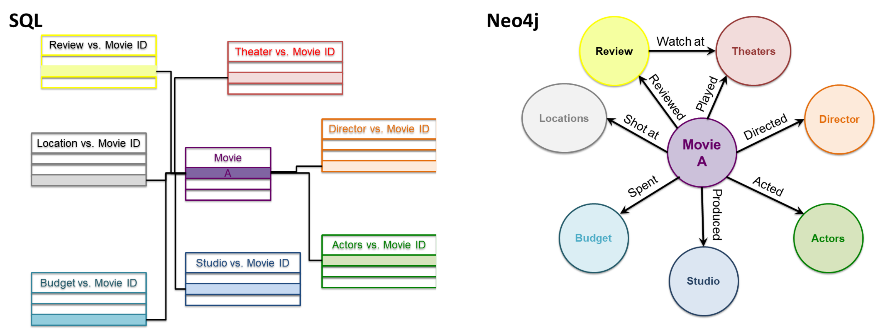

# Database
There are two types of databases, relational (i.e. RDB) and non-relational. The former is also called a relational database management system (RDBMS) or structured query language (SQL). In these databases, data are stored in a tabular schema of rows and columns, with each row indexed by a single row key representing its relations within and between tables. The latter not only SQL (NoSQL) database can store data in any of the following: Key-value, Graph, Wide column, and Document databases. Depending on the type of database, NoSQL stores and retrieves data with its own mechanisms, which are different from tabular relations – and some are more scalable and flexible.    

Examples 

•	Relational databases — MySQL, Microsoft SQL Server, PostgreSQL, and Oracle.

•	Non-relational databases ¬— MongoDB (Document), Neo4j (Graph), Cassandra (Wide Column), and Redis (Key-value).



In this section, I will use SQL (standard, RDB) and Neo4j (Graph, NoSQL) as example technologies and compare the similarities and differences by the following aspects. (1) Type of data sources. Although both technologies are designed for data storage and access, there are some differences in terms of the types of data used between SQL and Neo4j. In a SQL database, the collection of data tables is usually from a real-world record, for instance, calories and nutritional content in food from a grocery store. In a Neo4j graph database, on the other hand, data could be distributed elsewhere and gathered at different places and times, e.g., reviews on actors in different TV shows or movies. (2) Data structure and linkage (see the figure above). As described above, SQL stores data in a rows and columns format. The SQL schema organizes data into one or more tables and with each row indexed with a unique primary and foreign key, represents a one-to-many relationship across tables. In contrast, for Neo4j, a user will describe the data in a connected graph where he or she will explicitly assign the nodes, create a relationship between the nodes, and set properties and labels. (3) Data languages. SQL itself is a domain-specific language which allows users to design and manage a relational database; Neo4j uses Cypher graph query language designed for data retrieval in graph databases. Compared to SQL language, which is more about tables and JOINs, Cypher deals with relationships among the entities and uses more pictorial representations. (4) Query syntax. SQL —SELECT (what to display), FROM (choosing a data table), JOIN (combine tables), WHERE (set conditions), etc.; Neo4j — MATCH | CREATE (node 1: label {property}) <- [:Relationship] – (node 2: label {property}), WHERE (set conditions), RETURN (what to display), etc. It should be noted that, although the query looks similar to that of SQL, in Neo4j, users need to specify the network of nodes in the beginning of the query. See the coding samples below. (5) Scalability. While SQL is vertically scalable (i.e. appending more data in rows), Neo4j can be thought of as horizontally scalable and beyond (i.e. appending more objects not only in columns, but also with new relationships). In the long run, Neo4j becomes larger and powerful, thereby more suitable for big data management. (6) Application. SQL is a great fit for transaction-oriented systems such as e-commerce platforms and financial transactions and meets ACID (atomicity, consistency, isolation, durability) compliance, which protects the integrity of the data. In contrast, Neo4j is suitable for data that is unstructured and lacks a predefined schema, such as social media posts and article content, and follows the BASE consistency model, which allows the state of a database to change over time.  

# Neo4j Coding Example
```
SELECT product.name AS product_name,product.price, producer.name AS company_name

FROM product

LEFT JOIN sales_history
ON product.id = sales_history.product_id
AND date BETWEEN '2015-02-01' AND '2015-02-05'

JOIN producer 
ON producer.id = product.producer_id
WHERE amount IS NULL
```

# SQL Coding Example
```
query = """
MATCH (author: Author {name: "Peter G. Neumann"}) [:AUTHOR]-()-[:AUTHOR] (coauthors)  [:AUTHOR]-()-[:AUTHOR]  (cocoauthors)

WHERE author <> cocoauthors AND not((author)  [:AUTHOR]-()-[:AUTHOR]  (cocoauthors))

RETURN cocoauthors.name AS cocoauthors, count(*) AS collaborations
ORDER BY collaborations DESC
"""
graph.run(query).to_data_frame()
```

